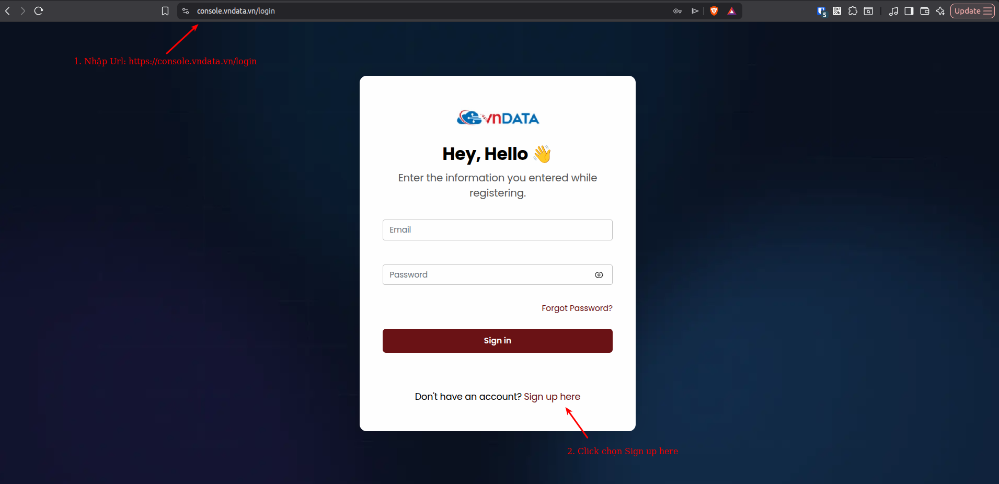
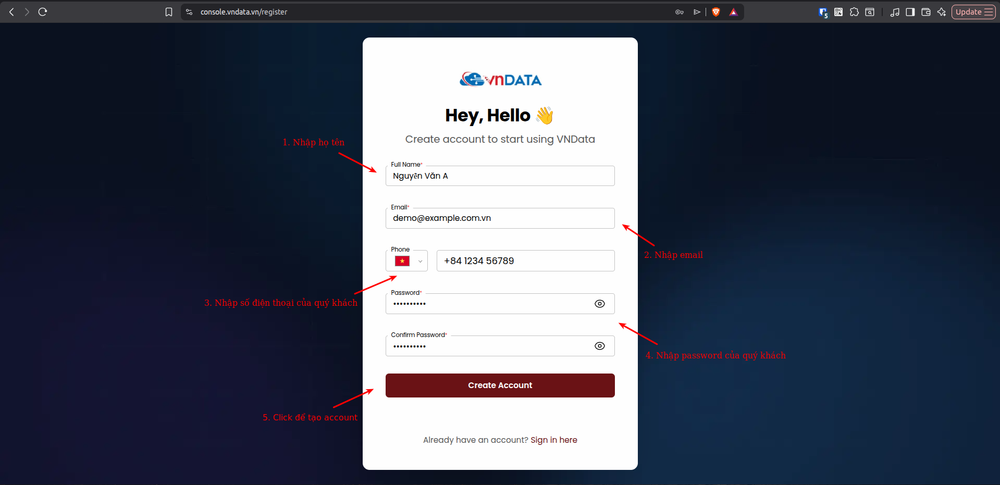
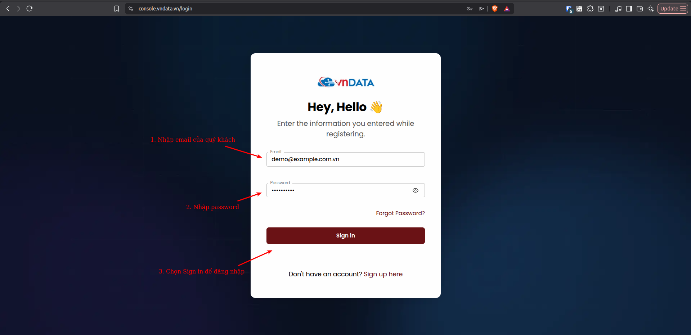
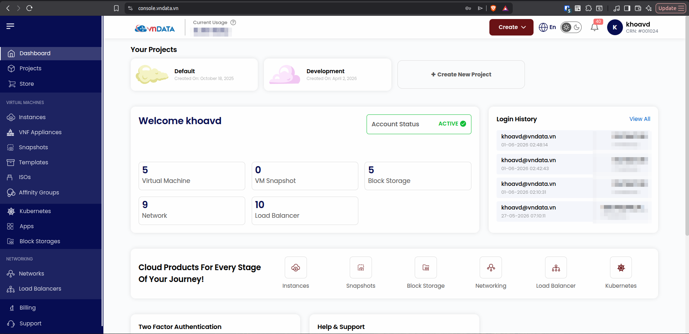

### Hướng dẫn đăng ký và sử dụng dịch vụ

### VNDATA Cloud Private Portal

Quý khách truy cập vào [link](https://console.vndata.vn/login) để đăng ký tài khoản và đăng nhập vào trang quản trị của dịch vụ **VNDATA Private Cloud**.

#### 1. Đăng ký

* **Bước 1:** Quý khách truy cập vào [link](https://console.vndata.vn/login) để vào trang quản trị.

* **Bước 2:** Điền các thông tin yêu cầu.

#### 2. Đăng nhập

Sau khi đăng ký xong, quý khách truy cập vào [link](https://console.vndata.vn/login) để đăng nhập vào trang quản trị.

* **Bước 1:** Quý khách truy cập vào [link](https://console.vndata.vn/login) để vào trang đăng nhập.
* **Bước 2:** Quý khách điền các thông tin đăng nhập vào mục *Email* và *Password* và chọn *Sign in*.

Sau khi đăng nhập thành công, quý khách sẽ được toàn quyền sử dụng các tính năng tương ứng của dịch vụ **VNDATA Private Cloud**.

  
*Trên đây là chi tiết các bước để đăng ký, xem thông tin và đăng nhập vào trang quản trị của dịch vụ VNDATA Private Cloud. Chúc quý khách có những trải nghiệm hài lòng nhất khi sử dụng dịch này của chúng tôi.*

