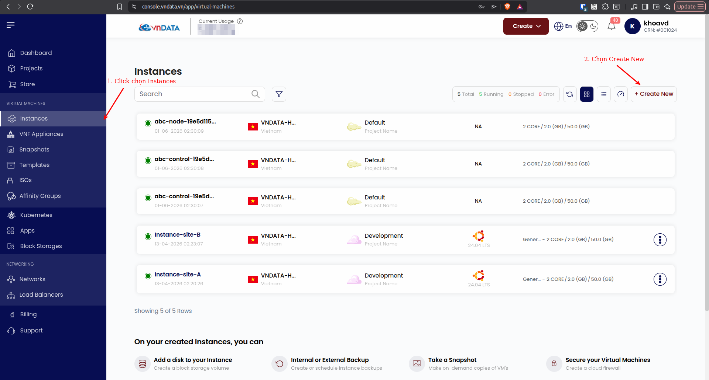
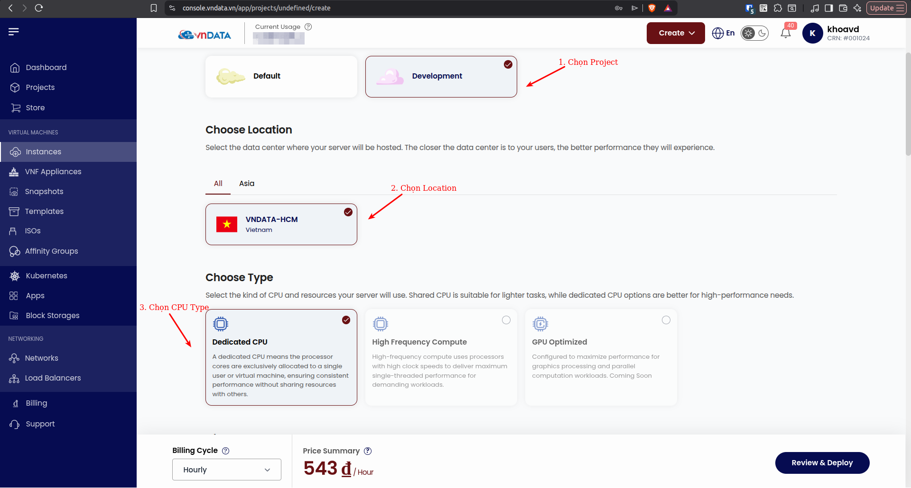
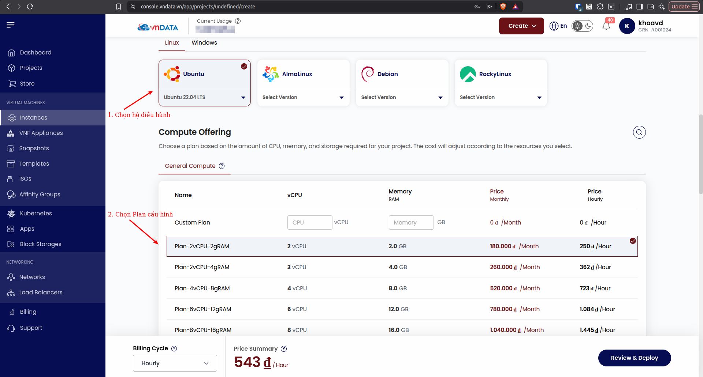
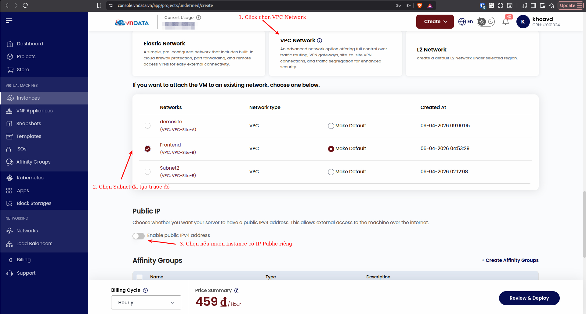
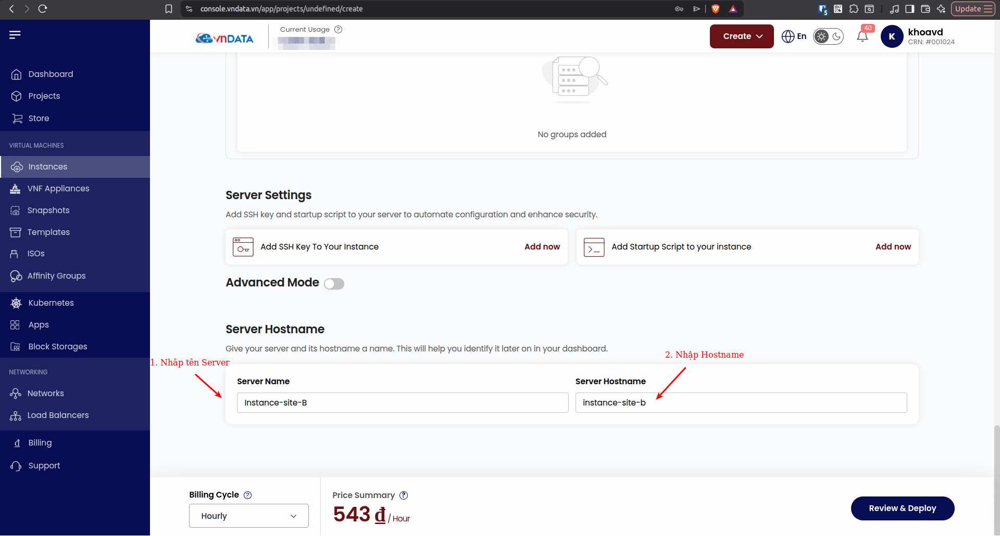
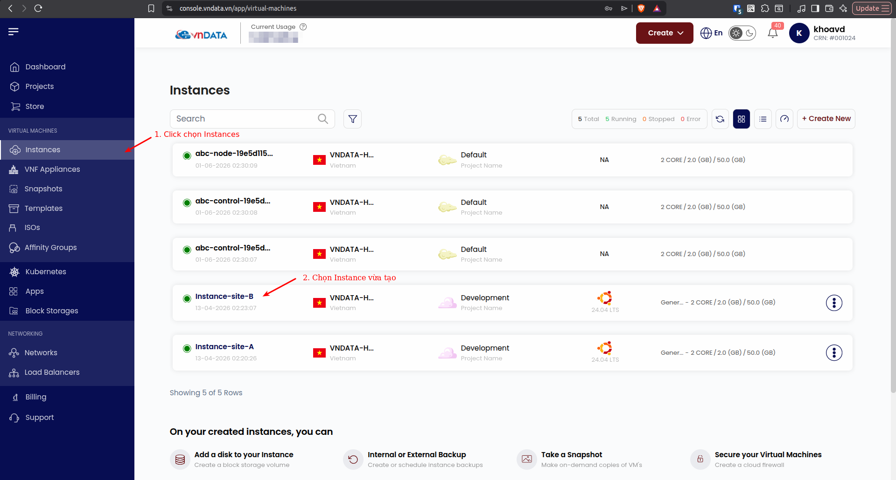
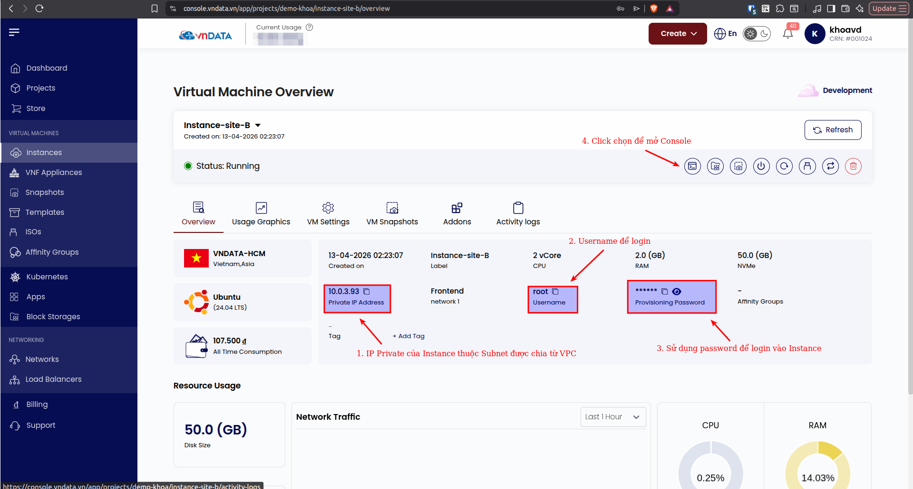
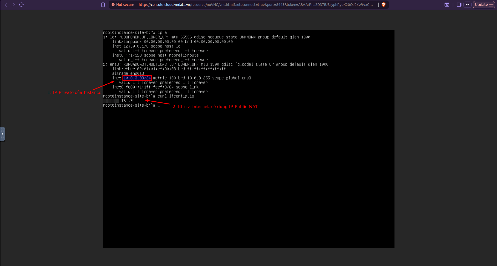

### Tạo Instances

Ở bài viết trước, VNDATA đã hướng dẫn quý khách cách tạo VPC Network, cách tạo subnet và kiểm tra IP Public của mình. Tiếp theo quý khách đã sẵn sàng để tạo *instance* (*server*) đầu tiên cho mình.

* **Bước 1:** Tại giao diện quản trị của VNDATA VPC, quý khách chọn tab *Instances*. Tại đây, thông tin về tất cả Instances đã tạo của quý khách được liệt kê. Quý khách click chọn *Create New*.

* **Bước 2:** Chọn *Project*, *Location* **VNDATA-HCM**. Hiện tại, VNDATA chỉ cung cấp hạ tầng máy chủ tại TP. Hồ Chí Minh. Chọn *Type* **Dedicated CPU**.

* **Bước 3:** Mục *Image*, quý khách có thể lựa chọn các hệ điều hành phù hợp. Linux hỗ trợ các Distro như Ubuntu, AlmaLinux, Debian..., mỗi Distro bao gồm các version từ mới đến cũ hơn. Sau khi chọn xong image, quý khách lựa chọn các plan cấu hình có sẵn tại mục *Compute Offering*, hoặc tự chọn cấu hình custom phù hợp, tương tự cho phần *Disk Offering*.

* **Bước 4:** Mục *Choose Network*, quý khách có thể chọn *Elastic Network*, *VPC Network*, hoặc *L2 Network*. VNDATA sẽ có các bài viết chi tiết về từng loại Network còn lại trong thời gian tới. Để phù hợp với phạm vi bài hướng dẫn, quý khách chọn **VPC Network**. Khi đó, quý khách có thể chọn các subnet phù hợp với mục tiêu thiết kế ban đầu. Nếu quý khách chưa tạo VPC Network từ trước, hệ thống VNDATA sẽ tự động tạo VPC Network và sử dụng IP trong Network này để gán cho Instance. Nếu quý khách muốn Instance có thêm IP Public, quý khách có thể chọn *Enable public IPv4 address (Optional)*

* **Bước 5:** Cuối cùng, quý khách có thể chọn thêm SSH-Key hoặc Scripts khởi tạo nếu cần. Đặt Server Name và Server Hostname cho Instance và ấn chọn *Review & Deploy*.

### Xem thông tin và truy cập Instance vừa khởi tạo

* **Bước 1:** Tại giao diện quản trị của VNDATA VPC, quý khách chọn tab *Instances*. Click chọn Instance vừa tạo.

* **Bước 2:** Thông tin cụ thể về Instance như là *Username*, *Password*, *IP*... được thể hiện ở đây. Click chọn *Console Access* để login và sử dụng Instance.

* **Bước 3:** Login và sử dụng Instance. IP tự động được gán cho Instance. Khi truy cập Internet, Instance sử dụng IP Public được NAT.

  
*Như vậy là với các bước như trên, quý khách đã tạo thành công Instance đầu tiên của mình. Mời quý khách tiếp tục theo dõi series bài viết về VPC tiếp theo của VNDATA. Chúc quý khách có những trải nghiệm hài lòng nhất khi sử dụng dịch này của chúng tôi.*

