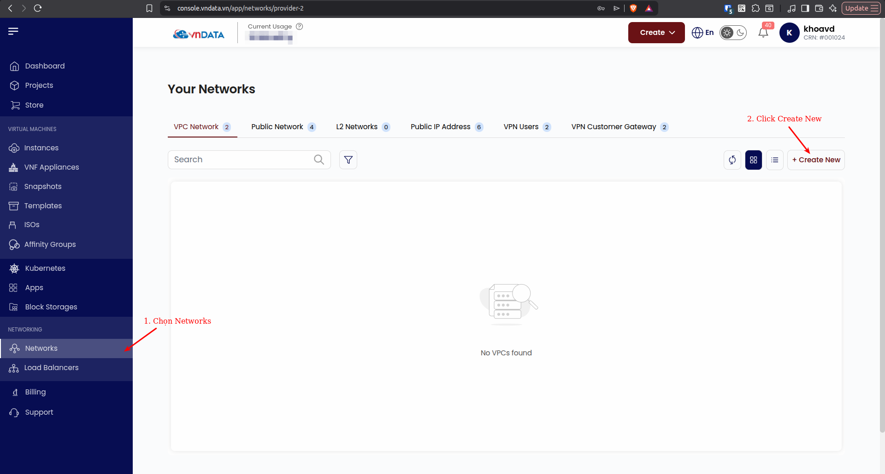
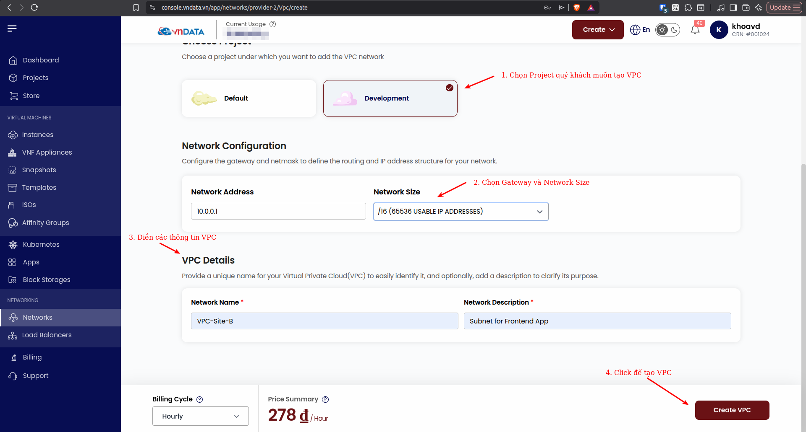
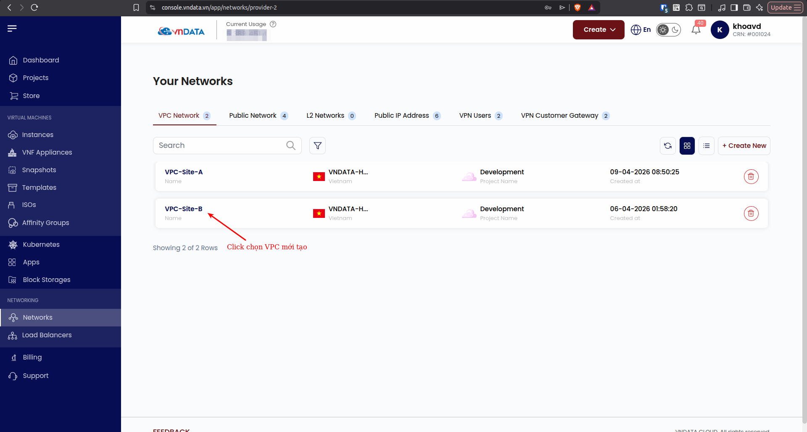
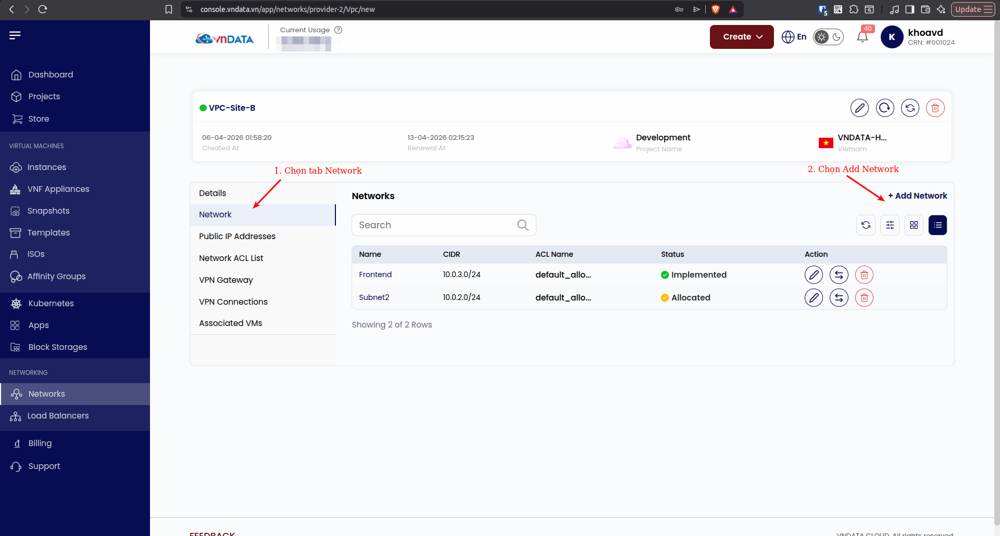
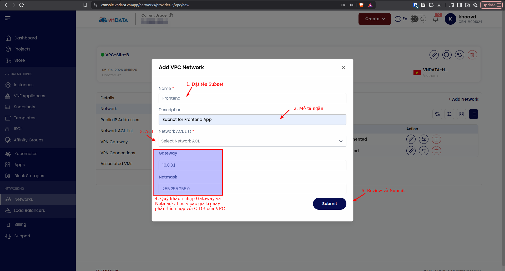
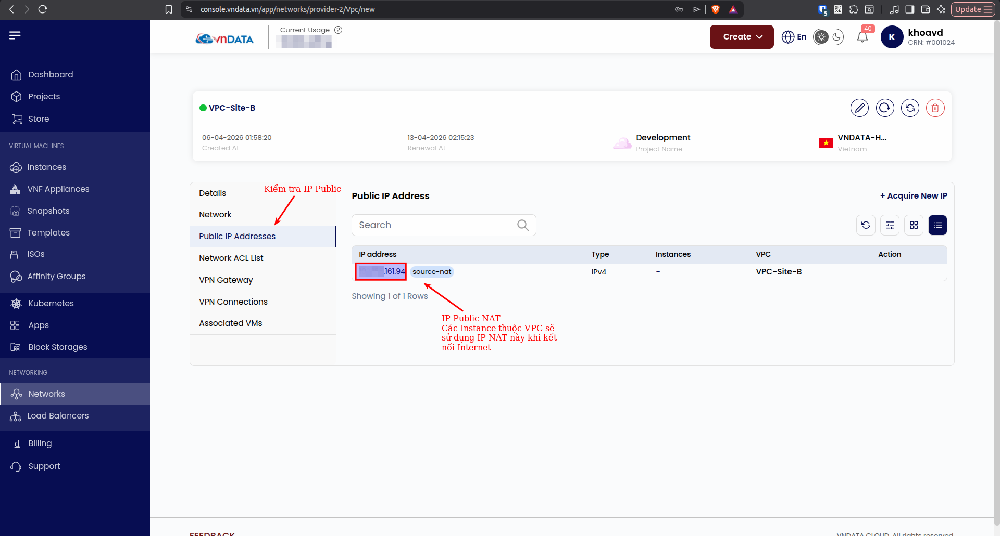

### Tạo VPC

#### 1. Tạo VPC Network

VPC Networks giúp quý khách có toàn quyền kiểm soát mạng riêng. Quý khách có thể chia subnet riêng cho các mục đích như subnet cho riêng ứng dụng frontend, backend, database... Nhờ tính năng này, quý khách hoàn toàn chủ động trong quá trình thiết kế hạ tầng mạng cho ứng dụng của mình.

* **Bước 1:** Tại giao diện quản trị của VNDATA VPC, quý khách chọn tab *Networks*. Ấn chọn *Create New*.

* **Bước 2:** Mục *Select Location*, chọn VNDATA-HCM. Hiện tại, VNDATA chỉ đang cung cấp dịch vụ tại máy chủ ở TP. Hồ Chí Minh.
* **Bước 3:** Mục *Choose Project*, quý khách chọn Project đã tạo trước đó.
* **Bước 4:** Mục *Network Configuration*, quý khách chọn CIDR phù hợp cho ứng dụng của mình. Lưu ý rằng khi quý khách muốn tạo các subnet, các subnet phải thuộc CIDR này, vì thế quý khách nên cân nhắc chọn network size phù hợp.
* **Bước 5:** Mục *VPC Details*, quý khách điền thông tin **Network Name** và **Network Description**.
* **Bước 6:** Nhấn chọn *Create VPC*.

#### 2. Tạo Subnet

Sau khi tạo thành công VPC Network, quý khách có thể tạo các subnet riêng từ VPC Network đã tạo. Tại giao diện quản trị, click chọn tab *Networks*, quý khách sẽ thấy tên VPC Network vừa được tạo, click chọn.
Quý khách sẽ thấy các thông tin chi tiết về VPC Network.

* **Bước 1:** Tại giao diện quản trị mạng VPC, click chọn tab *Network*, sau đó click chọn *VPC Network* quý khách vừa tạo.

* **Bước 2:** Trong tab *Network* click chọn *Add Network* để tạo subnet từ VPC Network.

* **Bước 3:** Điền các thông tin. Quý khách lưu ý, thông tin **Gateway** và **Netmask** phải phù hợp với thông tin **CIDR** mà quý khách đã tạo trước đó.

#### 3. Public IP Address

Khi quý khách tạo thành công VPC Network, hệ thống đồng thời tự động cung cấp cho quý khách một địa chỉ **IP Public**. Địa chỉ IP Public này sẽ được NAT, nhờ đó các Instance của quý khách có thể truy cập ra internet sử dụng địa chỉ **IP Public NAT** này.

  
*Như vậy là với các bước như trên, quý khách đã tạo thành công VPC Network đầu tiên của mình, cũng như tự tạo các Subnet. Mời quý khách tiếp tục theo dõi series bài viết về VPC tiếp theo của VNDATA. Chúc quý khách có những trải nghiệm hài lòng nhất khi sử dụng dịch này của chúng tôi.*

