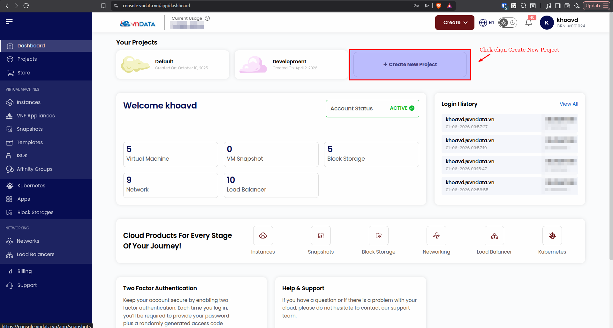
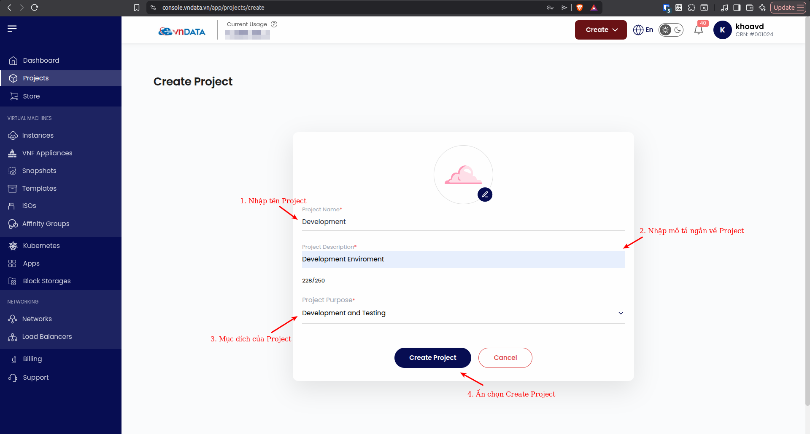
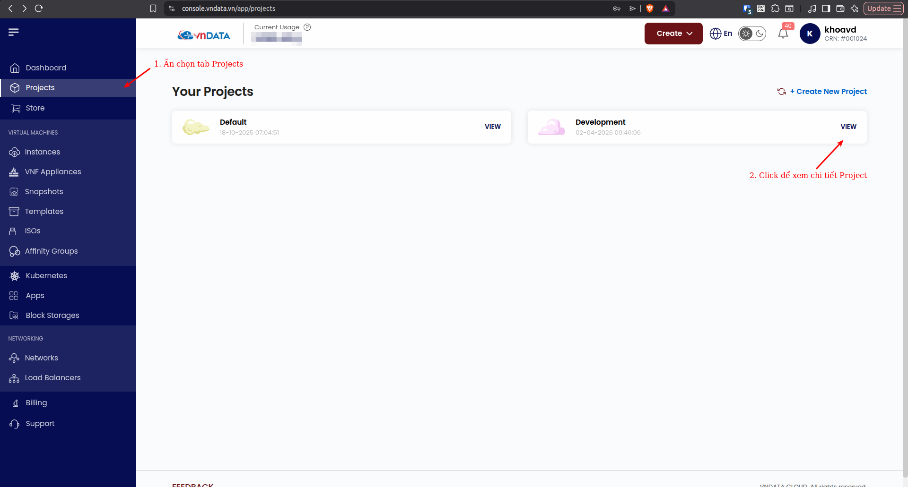

### Tạo Project

#### 1. Đăng nhập

Quý khách truy cập vào [link](https://console.vndata.vn/login) để đăng nhập giao diện quản trị của VNDATA Virtual Private Cloud (VPC), nếu quý khách chưa có tài khoản, vui lòng tham khảo link bài viết [link](https://img-wiki-vndata-vn.s3-hcm-r2.s3cloud.vn/virtual-private-cloud/dang-ky-va-dang-nhap) để đăng ký sử dụng dịch vụ VPC của VNDATA.

#### 2. Tạo Project

Sau khi đăng nhập thành công vào trang quản trị VNDATA VPC, quý khách tiến hành tạo Project đầu tiên. Project sẽ là nơi quý khách tạo VPC, Instances, Cluster Kubernetes...

* **Bước 1:** Quý khách click chọn mục *Create New Project*.

* **Bước 2:** Quý khách điền các thông tin cần thiết để tạo Project.

* **Bước 3:** Kiểm tra thông tin Project vừa tạo.

  
*Như vậy là với các bước như trên, quý khách đã tạo thành công project đầu tiên của mình. Mời quý khách tiếp tục theo dõi series bài viết về VPC tiếp theo của VNDATA. Chúc quý khách có những trải nghiệm hài lòng nhất khi sử dụng dịch này của chúng tôi.*

