### Tạo VPN

Kính chào quý khách.
Công cụ **VPN** đã không còn mới lạ với chúng ta. Trong quá trình thao tác với VPC, quý khách sẽ có thể có nhu cầu sử dụng VPN để kết nối được tới các Private Subnet của mạng VPC. Ở bài viết này, VNDATA sẽ hướng dẫn quý khách tạo và sử dụng **Remote Access VPN** và **Site to Site VPN**.

#### 1. Tạo Remote Access VPN

* **Bước 1:** Tại giao diện quản trị của *VNDATA VPC*, quý khách chọn tab *Networks*. Click chọn *Public IP Address*. Sau đó click chọn **IP Public** mà quý khách cần tạo kết nối VPN.
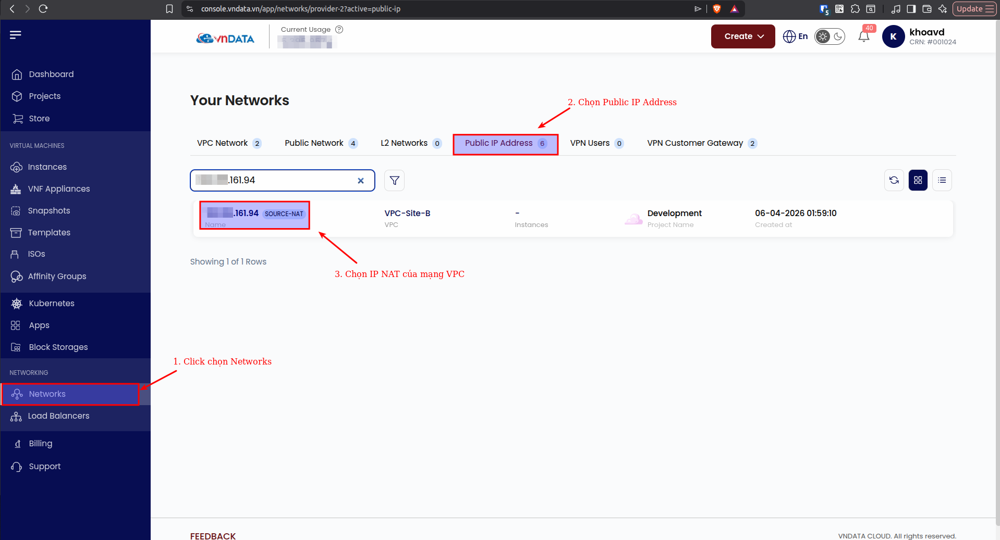

* **Bước 2:** Quý khách click tab *Remote Access VPNs*, sau đó chọn *Enable Remote Access*
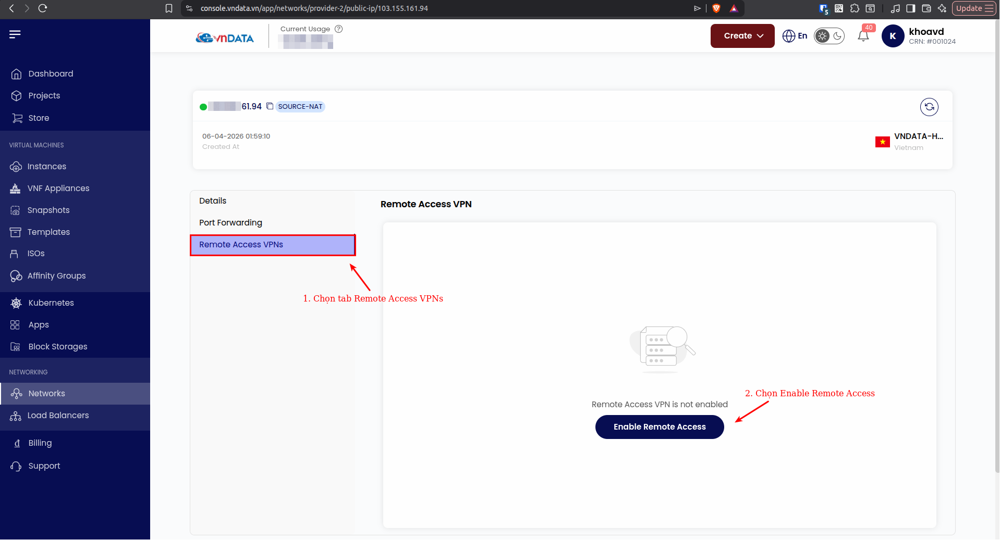

* **Bước 3:** Sau khi thành công enable tính năng *Remote Access VPN*, hệ thống sẽ cung cấp cho quý khách thông tin **IPSec-pre shared** (quý khách vui lòng ghi lại chuỗi này để sử dụng khi khởi tạo kết nối VPN về sau). Để tạo profile user mới, quý khách click *Add New User*. 
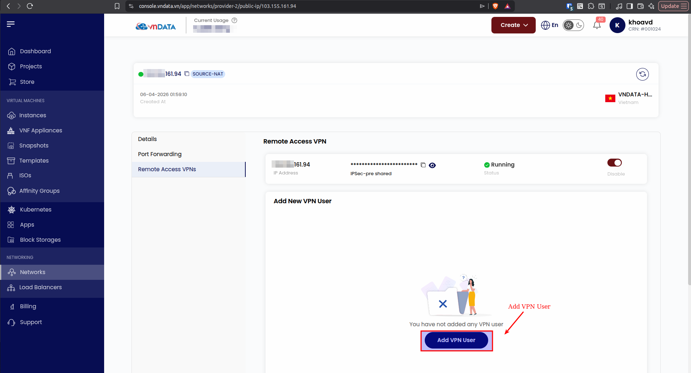

* **Bước 4:** Sau khi cửa sổ hiện lên, quý khách điền đầy đủ các thông tin như *username*, *password* và *project*. Quý khách vui lòng ghi chú lại thông tin, thông tin *username* và *password* sẽ được sử dụng để khởi tạo kết nối VPN cùng với chuỗi *IPSec-pre shared* như đã đề cập ở trên.
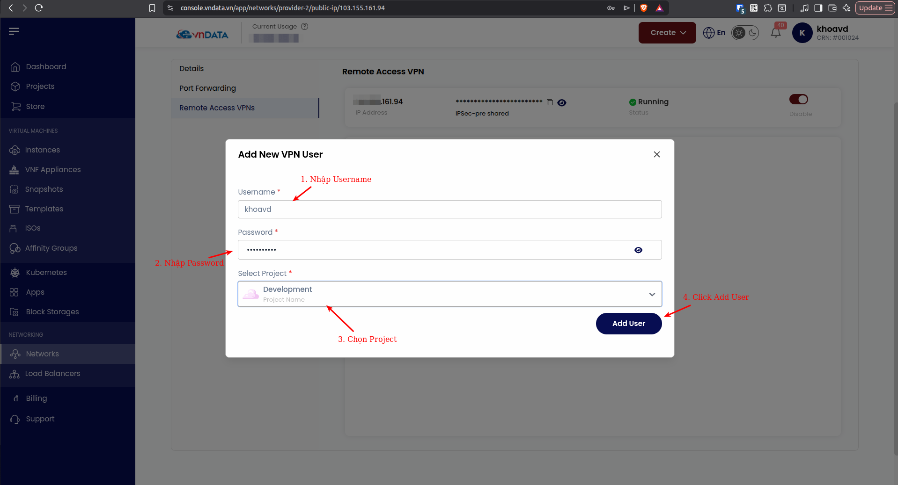

Vậy là quý khách đã tạo xong profile đầu tiên cho mình. Tiếp theo, tùy thuộc vào hệ điều hành Linux hoặc Windows mà chúng ta sẽ có cách cài đặt vpn client khác nhau.

#### 1.1 Cài đặt L2TP VPN trên Linux (Ubuntu)

Ubuntu là distro rất phổ biến với người dùng Linux. VNDATA sẽ hướng dẫn quý khách cách cài đặt L2TP VPN trên Ubuntu.

* **Bước 1:** Cài đặt network-manager-l2tp và network-manager-l2tp-gnome với câu lệnh sau:
**sudo apt install network-manager-l2tp network-manager-l2tp-gnome**

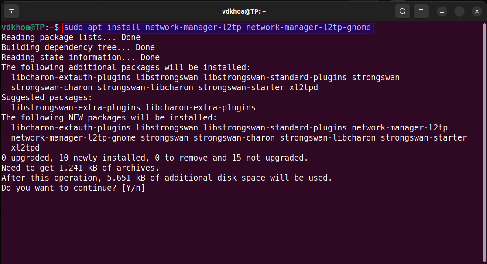

* **Bước 2:** Truy cập mục *Settings*, chọn tab *Network*. Ở phần VPN, click chọn dấu + để thêm VPN. Quý khách chọn **Layer 2 Tunneling Protocol (L2TP)**.

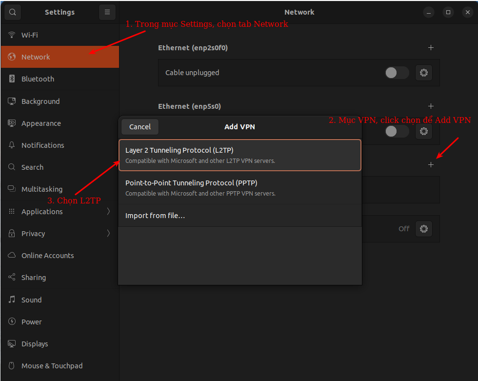

* **Bước 3:** Cửa sổ Add VPN hiện lên, quý khách cần điền các thông tin quan trọng như tên *VPN*, *gateway*, *username* và *password*.

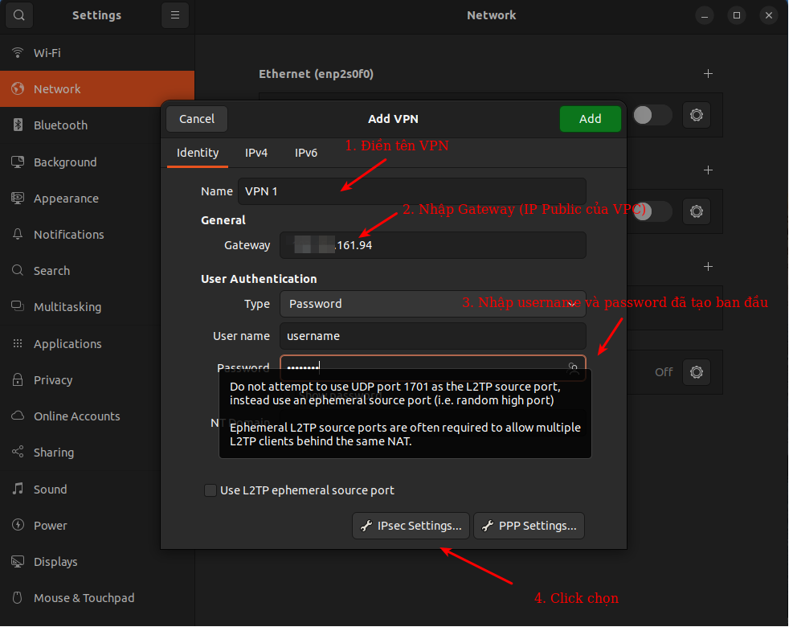

* **Bước 4:** Click chọn *IPsec Settings*, quý khách thực hiện tick chọn **Enable IPsec tunnel** và nhập key. Kiểm tra key đúng với key đã lưu khi enable *Remote Access VPN*.

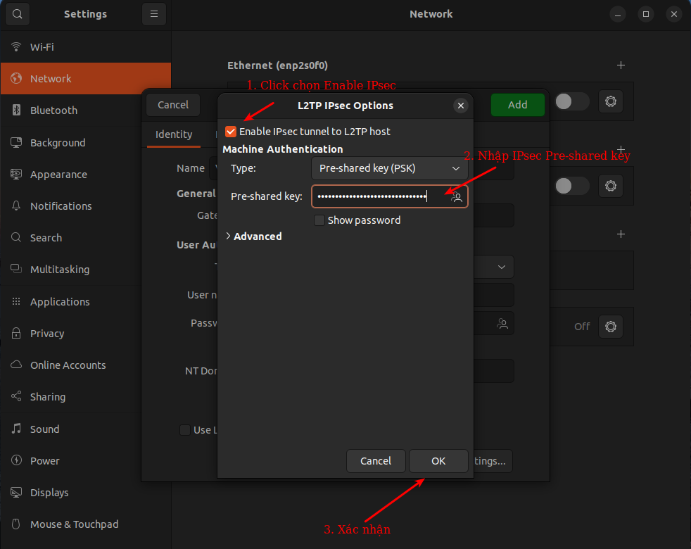

* **Bước 5:** *Mục PPP Settings*, quý khách chỉ chọn option **MSCHAPv2**. Sau đó, cuối cùng ấn ADD để thêm VPN.

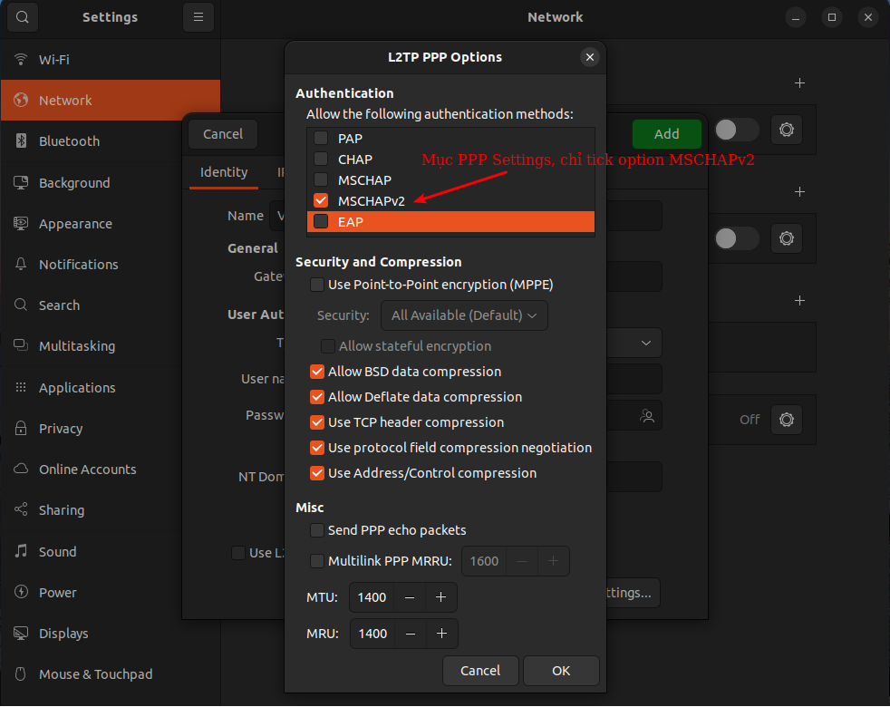

* **Bước 6:** Sau khi đã kết nối VPN, quý khách mở terminal, nhập lệnh **ip route** để kiểm tra. Nếu xuất hiện **dev ppp0** như hình thì vpn đã tạo kết nối thành công. Từ máy tính cá nhân, quý khách đã có thể kết nối tới Instance như hình.

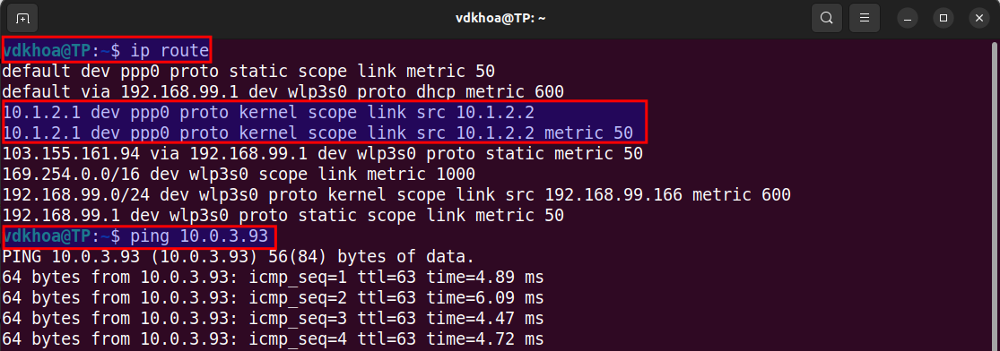

#### 1.2 Cài đặt L2TP VPN trên Windows Server

Để cài đặt *L2TP VPN* trên **Windows Server**, quý khách thực hiện các bước sau:

* **Bước 1:** Click chọn biểu tượng Windows, sau đó chọn *Settings*, rồi chọn *Network and Internet*.

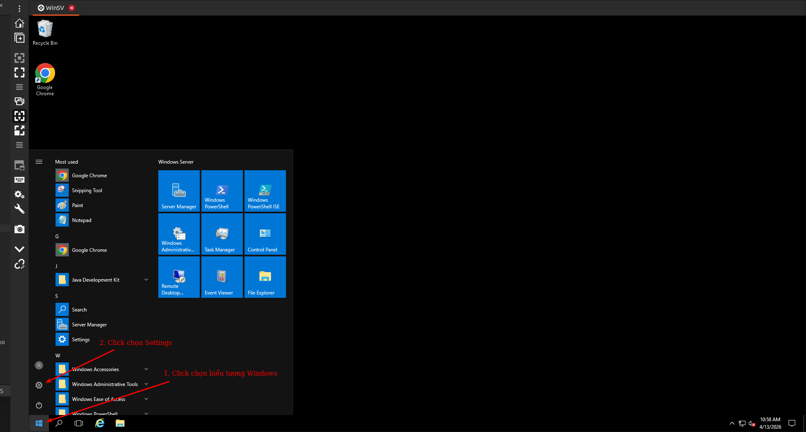

* **Bước 2:** Ở giao diện *Network & Internet*, chọn *VPN*. Sau đó chọn *Add a VPN connection*.

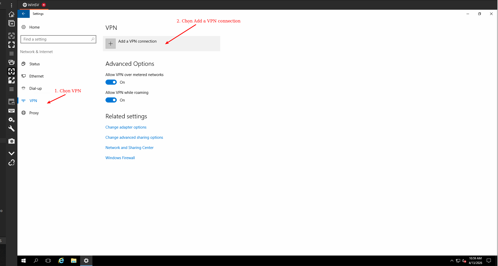

* **Bước 3:** Điền đầy đủ thông tin *VPN Connection*. Quý khách có thể lấy thông tin ở phần **Remote Access VPN** ở giao diện quản trị VNDATA VPC đã tạo ở mục 1.

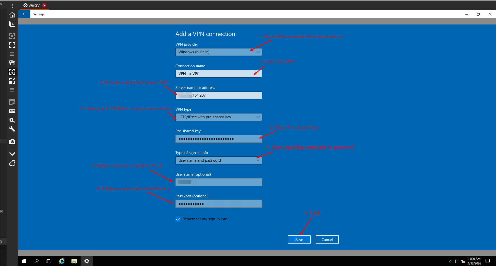

* **Bước 4:** Sau khi tạo xong VPN connection, quý khách tạm thời **không connect** để tránh mất mạng. Bước tiếp theo, quý khách cần cấu hình thêm một số mục. Chọn *Change adapter options*, click chuột phải tại kết nối VPN vừa tạo, chọn *Properties*.
Trong tab *Networking*, tại option *TCP/IPv4*, click *Properties*. Tiếp tục click chọn *Advanced*, trong cửa sổ *Advanced TCP/IP Settings*, quý khách **bỏ chọn** *Use default gateway on remote network*. Thao tác này ngăn việc route tất cả traffic qua tunnel VPN gây mất kết nối Internet.

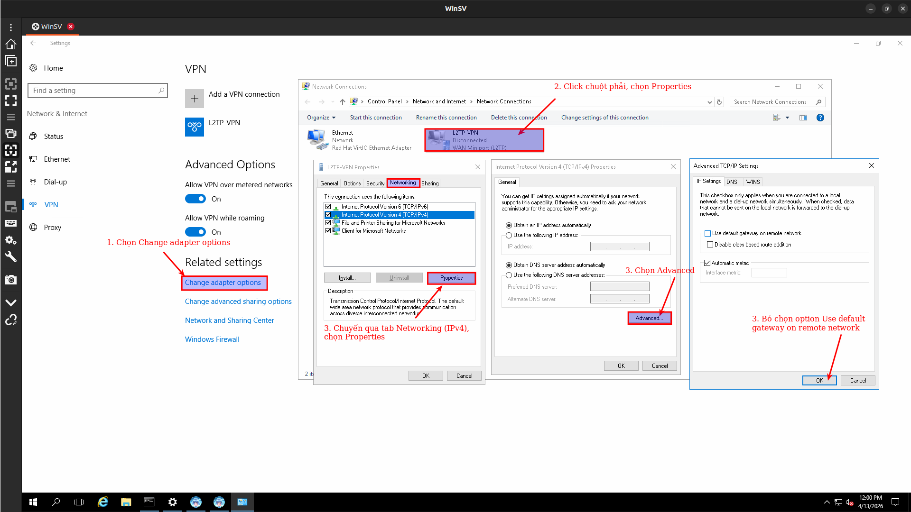

Ngoài ra, tại tab *Security*, mục *Authentication*, quý khách click chọn *Allow these protocols*, và chỉ chọn *MS-CHAP v2*.

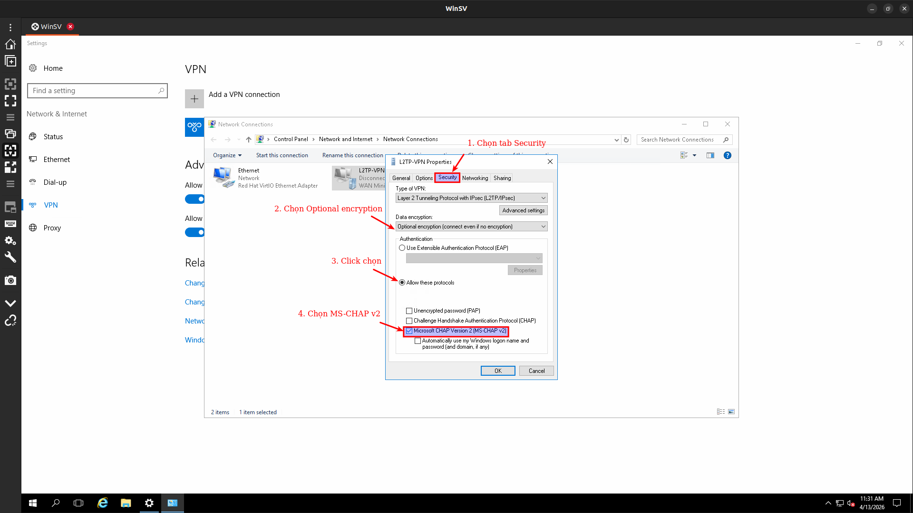

Như vậy là cấu hình cơ bản VPN đã xong, quý khách chọn connect VPN. Một khi connect thành công, quý khách kiểm tra bằng cách mở *CMD*, nhập:
**ipconfig**, **route print** để kiểm tra thông tin VPN.

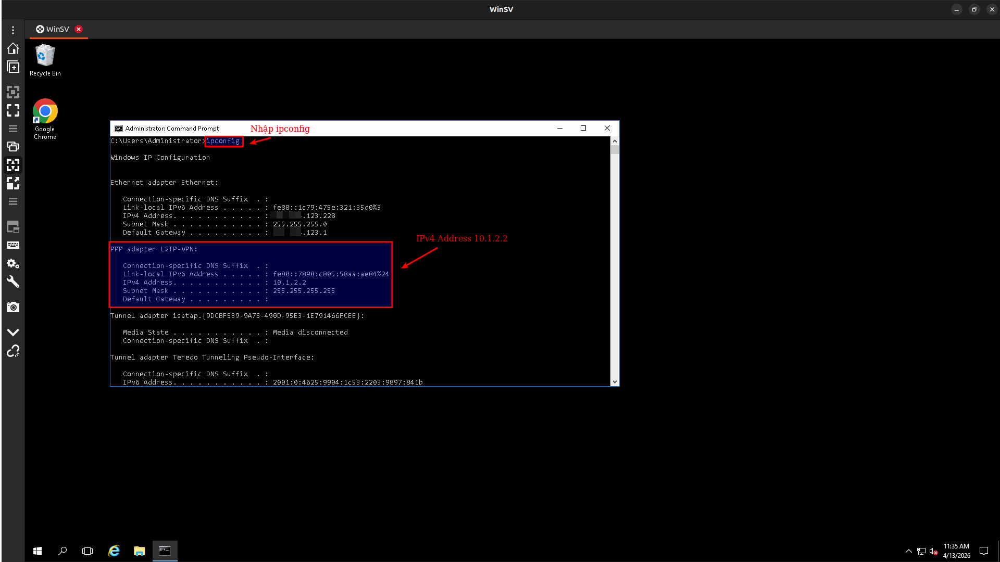

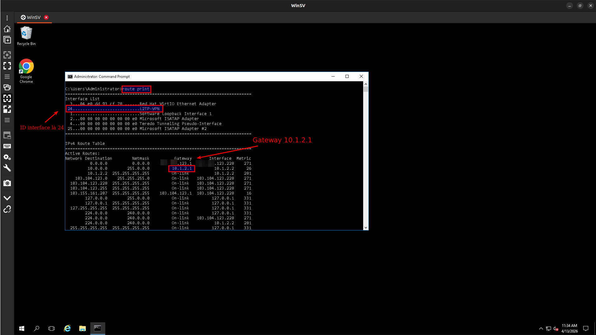

Tiếp theo khi đã có thông tin gateway VPN, quý khách nhập lệnh để thêm route tới Subnet của VPC.
**route add 192.168.0.0 mask 255.255.255.0 10.1.2.1 if 24**.
Sau khi thêm route thành công, quý khách đã có thể kết nối tới instance có IP **192.168.0.225** (thuộc subnet 192.168.0.0/24 của VPC).

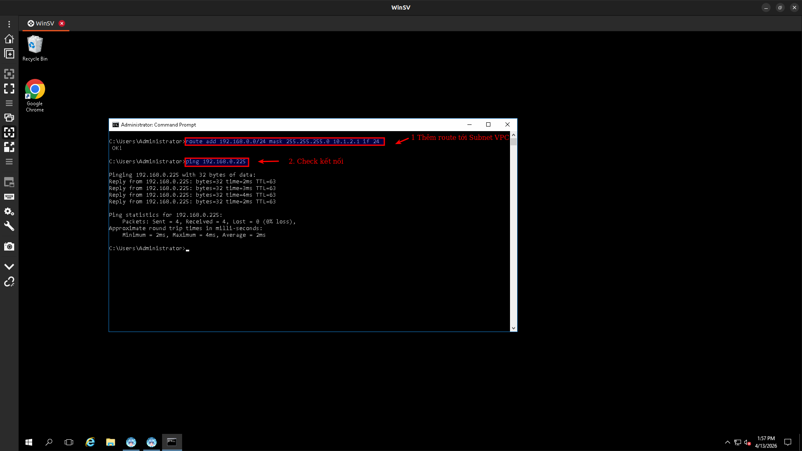

#### 2. Tạo Site-to-Site VPN

Trong trường hợp quý khách cần kết nối hệ thống hạ tầng tại chỗ (office) với môi trường VPC, hoặc kết nối giữa các VPC khách nhau, **Site-to-Site VPN** là giải pháp giúp các hệ thống này giao tiếp với nhau như trong cùng một mạng nội bộ.
Trong bài viết này, VNDATA sẽ hướng dẫn quý khách cách tạo **Site-to-Site VPN** giữa hai VPC khác nhau. Mục tiêu có thể kết nối *VPC-Site-A* (192.168.0.0/24) với *VPC-Site-B* (10.0.0.0/16).

Từ các bài hướng dẫn trước, hiện tại *VPC-Site-A* có Instance có IP 192.168.0.225, *VPC-Site-B* có Instance có IP 10.0.3.93. Trước khi có VPN Site-to-Site, thử kiểm tra kết nối giữa 2 instances (2 sites) như hình:
Kết quả là 2 VPC chưa kết nối được với nhau.

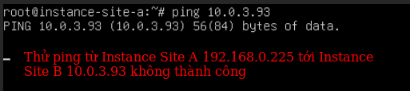

* **Bước 1:** Đầu tiên, tại giao diện *VNDATA VPC*, quý khách chọn tab *Networks*, chọn *VPC-Site-A*, chọn *VPN Gateway*. Cuối cùng click chọn *Create Site To Site VPN*. Sau bước này, **VPN Gateway** sẽ được tạo thành công. Quý khách ghi chú lại IP này để sử dụng ở bước tiếp theo. Thao tác tương tự với *VPC-Site-B* để tạo VPN Gateway.

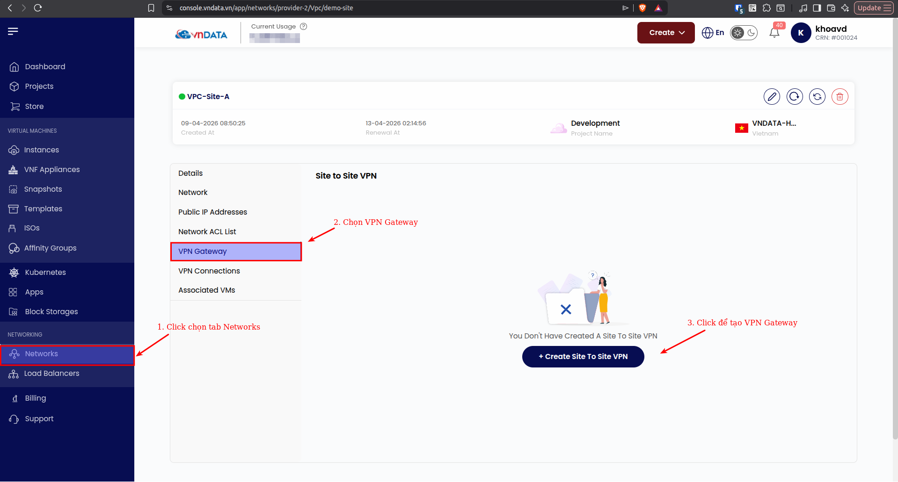

* **Bước 2:** Sau khi tạo thành công **VPN Gateway** ở cả 2 sites, quý khách cần tạo **VPN Customer Gateway**. VPN Customer Gateway cần thiết để site còn lại biết cách thực hiện kết nối.
Quý khách lưu ý, CIDR List sẽ là network của Site mà quý khách muốn kết nối tới, cũng như Gateway là IP Public của Site mà quý khách cần kết nối tới.
Quý khách có thể tham khảo [link](https://docs.cloud.google.com/network-connectivity/docs/vpn/how-to/generating-pre-shared-key) để tạo chuỗi ngẫu nhiên IPsec Preshared Key

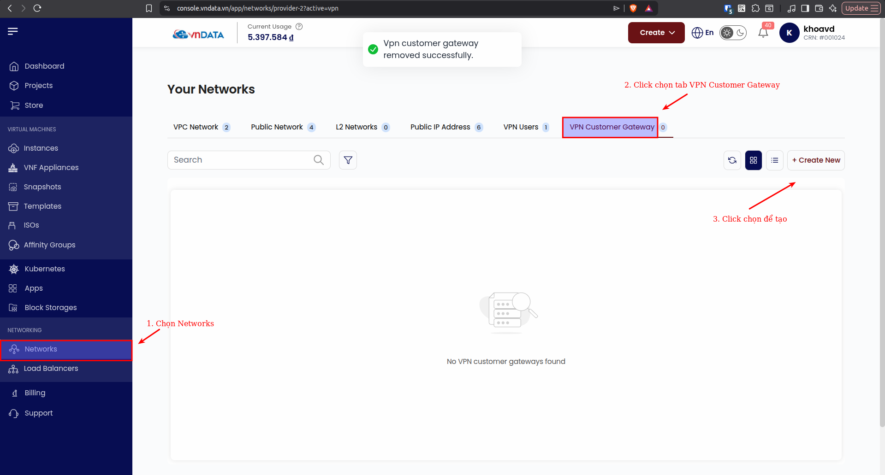

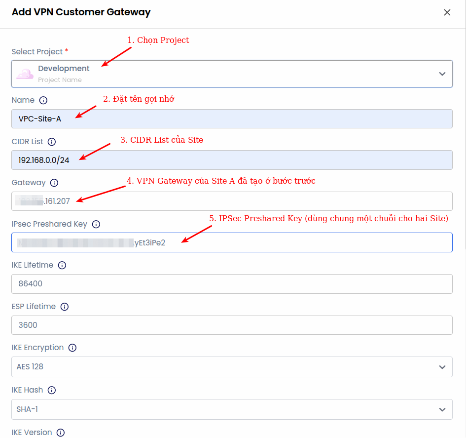

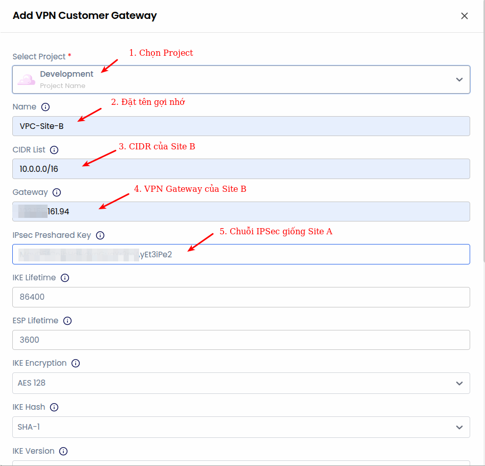

* **Bước 3:** Sau khi đã có VPN Customer Gateway, tiếp theo ta có thể tiến hành tạo VPN Connections giữa 2 Site. Click chọn tab *Networks*, chọn VPC Site A, chọn *VPN Connections*, sau đó click chọn *Create Site To Site VPN*. 
 
 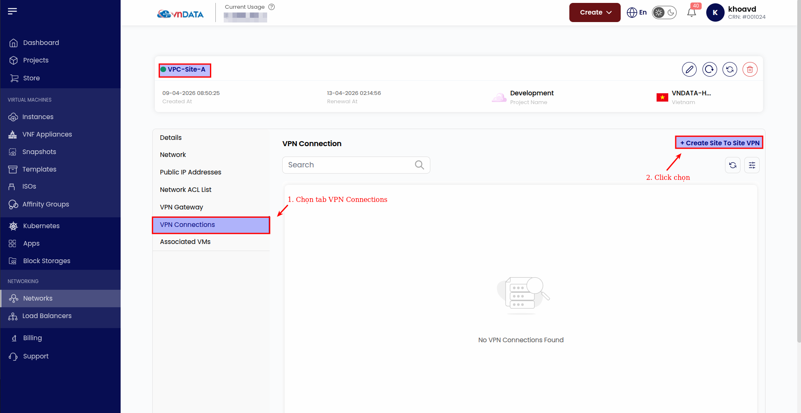
 
Vì ta đang cấu hình VPN cho site A trước, ta sẽ chọn VPC-Site-B mà ta đã tạo ở bước trước.

 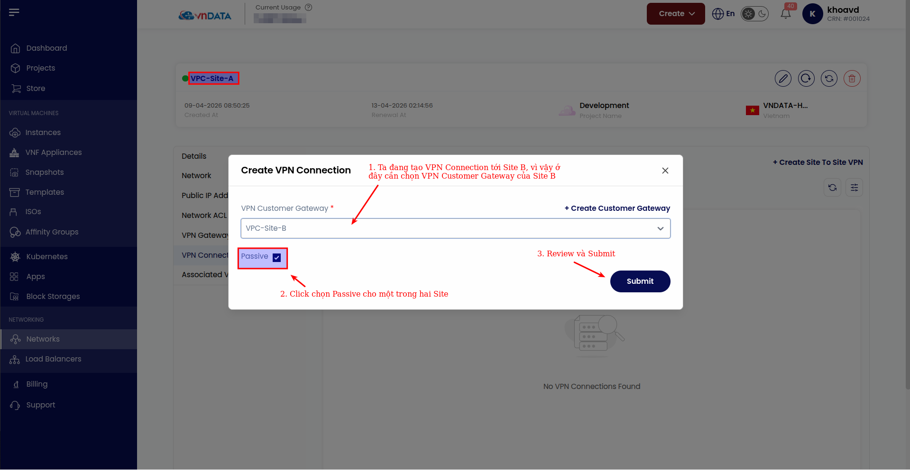

Thực hiện tương tự với Site B, ta sẽ chọn VPC-Site-A để tạo kết nối VPN từ Site B tới Site A.

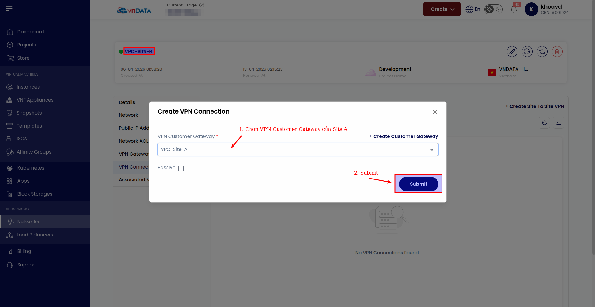

* **Bước 4:** Sau khi đã có VPN Connection ở 2 sites, tiến hành kiểm tra thử kết nối giữa 2 sites. Từ instance ở site A **192.168.0.225** đã ping thành công tới instance ở site B **10.0.3.93**.
 
 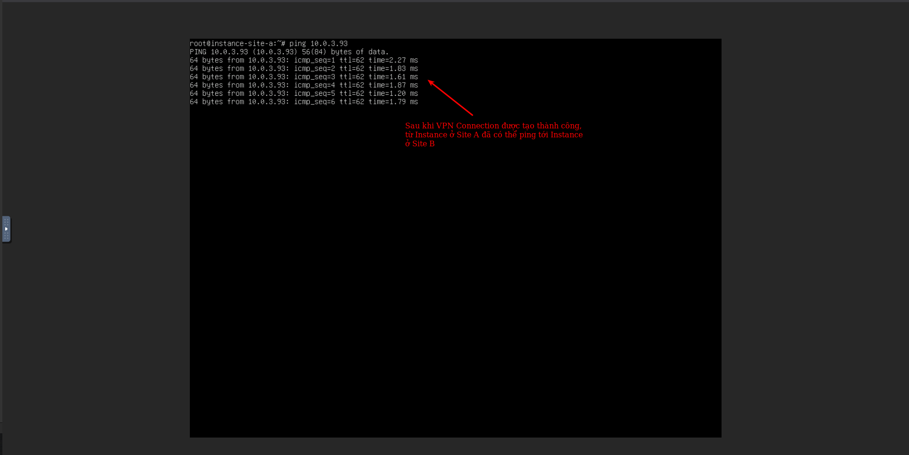

*Như vậy, chỉ với các bước trên VNDATA đã hướng dẫn quý khách cách tạo *Remote Access VPN* cũng như *Site To Site VPN*. Mời quý khách tiếp tục theo dõi series bài viết về VPC tiếp theo của VNDATA. Chúc quý khách có những trải nghiệm hài lòng nhất khi sử dụng dịch này của chúng tôi.* 

